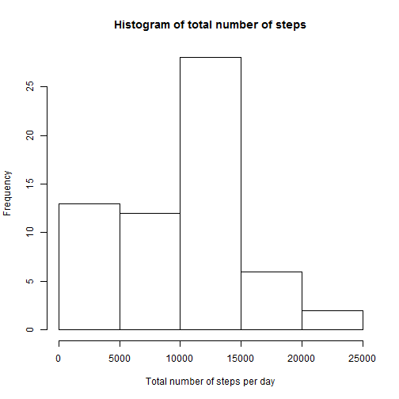
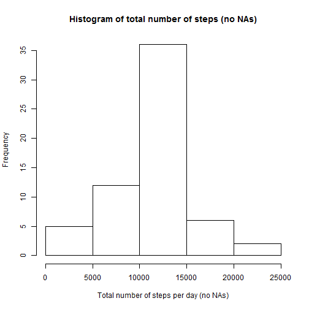
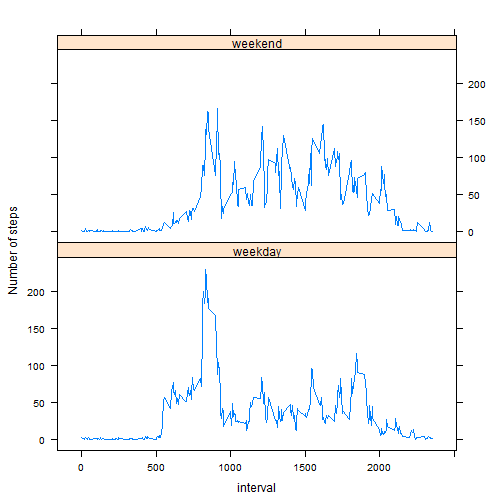

## Loading and preprocessing the data
First, check if we have the activity.csv file.
If not, we unzip it from the activity.zip file.
Then we read it to the data frame.

```r
if (!file.exists("activity.csv")) {
    unzip("activity.zip")
}
data <- read.csv("activity.csv")
```
Looks like there are days (for example the first day 2012-10-01) where none of the steps were measured so they are all NAs.

```r
head(data)
```

```
##   steps       date interval
## 1    NA 2012-10-01        0
## 2    NA 2012-10-01        5
## 3    NA 2012-10-01       10
## 4    NA 2012-10-01       15
## 5    NA 2012-10-01       20
## 6    NA 2012-10-01       25
```


## What is mean total number of steps taken per day?
Examine the data per day, I look at the total number of steps, mean of steps and I count how many intervals have measurements.


```r
require(plyr)
data.per.day <- ddply(data,"date",summarise, 
                      sum=sum(steps,na.rm=TRUE),
                      mean=mean(steps,na.rm=TRUE), 
                      count=sum(!is.na(steps)))
head(data.per.day)
```

```
##         date   sum    mean count
## 1 2012-10-01     0     NaN     0
## 2 2012-10-02   126  0.4375   288
## 3 2012-10-03 11352 39.4167   288
## 4 2012-10-04 12116 42.0694   288
## 5 2012-10-05 13294 46.1597   288
## 6 2012-10-06 15420 53.5417   288
```
This is a histogram of the total number steps taken each day.

```r
hist(data.per.day$sum, xlab='Total number of steps per day', 
     main='Histogram of total number of steps')
```

 

And we can see the **mean** (9354) and **median** (10395) total number of setps taken per day.

```r
mean(data.per.day$sum)
```

```
## [1] 9354
```

```r
median(data.per.day$sum)
```

```
## [1] 10395
```

```r
# summary(data.per.day$sum)
```

## What is the average daily activity pattern?
Examine the data per interval (across all days)

```r
data.per.interval <- ddply(data,"interval",summarise,
                           sum=sum(steps,na.rm=TRUE),
                           mean=mean(steps,na.rm=TRUE))
head(data.per.interval)
```

```
##   interval sum    mean
## 1        0  91 1.71698
## 2        5  18 0.33962
## 3       10   7 0.13208
## 4       15   8 0.15094
## 5       20   4 0.07547
## 6       25 111 2.09434
```
And we can show a time series plot of the 5-minute intervals and the average number of steps taken.

```r
plot(data.per.interval$interval,data.per.interval$mean,type="l",
     xlab="Interval",ylab="Average number of steps")
```

 

We find the interval with maxinum average number of steps (across all days). This interval turns out to be 835 or the time 8:35 AM to 8:40 AM

```r
max <- max(data.per.interval$mean)
subset(data.per.interval,mean==max)
```

```
##     interval   sum  mean
## 104      835 10927 206.2
```

## Imputing missing values

We can find out that there are 2304 rows of NA values in the origianl dataset.

```r
sum(is.na(data$steps))
```

```
## [1] 2304
```

We will just fill in the missing values with the average (across all days) number of steps for that interval

```r
data2 <- ddply(data, .(interval), mutate, avg=mean(steps,na.rm=TRUE))
data2[is.na(data2$steps),]$steps <- data2[is.na(data2$steps),]$avg 
```

With the mising values filled in, I again look at the total number of steps and mean of steps.

```r
data2.per.day <- ddply(data2,"date",summarise, 
                      sum=sum(steps,na.rm=TRUE),
                      mean=mean(steps,na.rm=TRUE), 
                      count=sum(!is.na(steps)))
head(data2.per.day)
```

```
##         date   sum    mean count
## 1 2012-10-01 10766 37.3826   288
## 2 2012-10-02   126  0.4375   288
## 3 2012-10-03 11352 39.4167   288
## 4 2012-10-04 12116 42.0694   288
## 5 2012-10-05 13294 46.1597   288
## 6 2012-10-06 15420 53.5417   288
```

This is a histogram of the total number steps taken each day after the missing values were filed in.

```r
hist(data2.per.day$sum, xlab='Total number of steps per day (no NAs)', 
     main='Histogram of total number of steps (no NAs)')
```

 

With missing values filled in the **mean** and **median** total number of setps taken per day both became 10766 - the previous mean.  This is as expected.

```r
mean(data2.per.day$sum)
```

```
## [1] 10766
```

```r
median(data2.per.day$sum)
```

```
## [1] 10766
```

```r
# summary(data2.per.day$sum)
```

Introduce another column "datetype" which tells us if the date was a weekday or not.

```r
getDateType <- function(x) {
    if (weekdays(as.Date(x),abbreviate=TRUE) %in% c("Sat","Sun")) {
		"weekend"
	} else {
		"weekday"
	}
}
data3 <- data2
data3$datetype <- sapply(data3$date, getDateType) 
data3$datetype <- factor(data3$datetype)
head(data3,n=7)
```

```
##    steps       date interval   avg datetype
## 1  1.717 2012-10-01        0 1.717  weekday
## 2  0.000 2012-10-02        0 1.717  weekday
## 3  0.000 2012-10-03        0 1.717  weekday
## 4 47.000 2012-10-04        0 1.717  weekday
## 5  0.000 2012-10-05        0 1.717  weekday
## 6  0.000 2012-10-06        0 1.717  weekend
## 7  0.000 2012-10-07        0 1.717  weekend
```

Now I again examine the steps per interval (across all days), but differentiate if the date was a weekday or not.

```r
data3.per.interval <- ddply(data3,.(interval,datetype),summarise,
                           sum=sum(steps,na.rm=TRUE),
                           mean=mean(steps,na.rm=TRUE))
head(data3.per.interval)
```

```
##   interval datetype      sum    mean
## 1        0  weekday 101.3019 2.25115
## 2        0  weekend   3.4340 0.21462
## 3        5  weekday  20.0377 0.44528
## 4        5  weekend   0.6792 0.04245
## 5       10  weekday   7.7925 0.17317
## 6       10  weekend   0.2642 0.01651
```
We show a panel plot of average number of steps per interval.


```r
library(lattice)
xyplot( mean ~ interval | datetype, data = data3.per.interval, layout = c(1,2),
        type="l", ylab="Number of steps")
```

 

